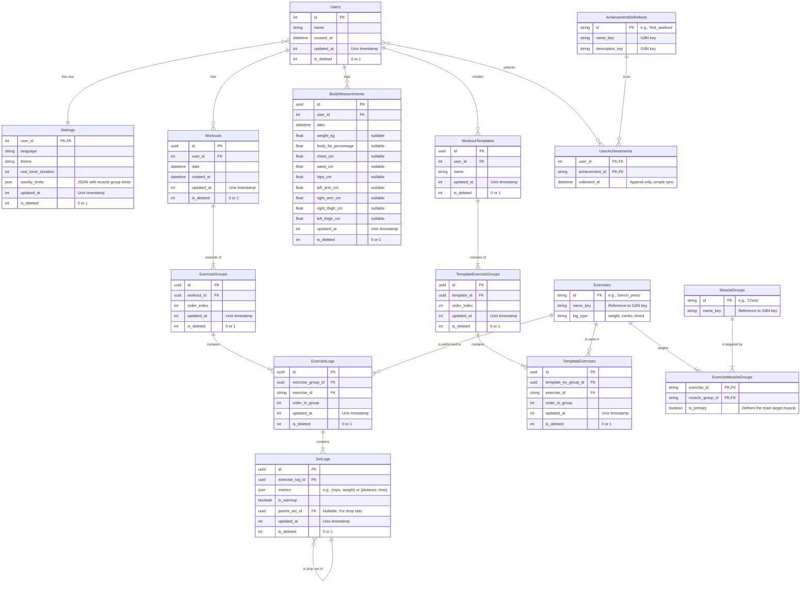

Схема БД

#### **5. Детализированные задачи по разработке данных и бэкенда**

Этот раздел — ключевое дополнение, детализирующее работу для Участников 3 и 4.

Ваша основная задача — создать надёжный фундамент для данных как на клиенте, так и на сервере, и обеспечить Flutter-приложению удобный способ работы с локальной базой.

**Этап 1: Проектирование и реализация локальной БД (SQLite)**

1. **Выбор инструментария:**
    
    - Оценить и выбрать библиотеку для работы с SQLite во Flutter. Рекомендуемый выбор — **drift** (бывший moor), так как он предлагает генерацию кода, строго типизированные запросы и поддержку миграций. Альтернатива — sqflite с ручным написанием SQL-запросов.
        
2. **Проектирование схемы данных для SQLite:**
    
    - Создать детальную схему всех таблиц (workouts, exercise_logs, set_logs, templates, body_measurements, user_settings и т.д.).
        
    - Определить типы данных, первичные и внешние ключи, индексы и ограничения (constraints).
        
    - **Важно:** Добавить в каждую синхронизируемую таблицу системные поля:
        
        - id (TEXT, UUID) — уникальный идентификатор, который будет одинаковым на клиенте и сервере.
            
        - updated_at (INTEGER, Unix timestamp) — время последнего изменения записи.
            
        - is_deleted (INTEGER, 0 или 1) — флаг для "мягкого" удаления (soft delete).
            
        - is_dirty (INTEGER, 0 или 1) — флаг, указывающий, что запись была изменена локально и нуждается в синхронизации.
            
3. **Реализация слоя доступа к данным (Data Access Layer) во Flutter:**
    
    - Написать **Репозитории** для каждой сущности. Например, WorkoutRepository.
        
    - Эти классы будут содержать методы для всех CRUD-операций (например, getWorkoutsForDate, saveWorkout, markWorkoutAsDeleted). **Именно этот слой будет использовать Frontend-разработчик (Участник 1), а не голые SQL-запросы.**
        
4. **Реализация миграций:**
    
    - Написать и протестировать механизм миграций для drift или sqflite, чтобы в будущем можно было безболезненно обновлять схему БД у пользователей.
        

**Этап 2: Проектирование серверной БД и стратегии синхронизации**

1. **Проектирование схемы данных для PostgreSQL/SQL Server:**
    
    - Адаптировать схему SQLite для серверной реляционной СУБД. Схема будет очень похожей, но с добавлением таблицы users для аутентификации.
        
    - Написать миграции с использованием **Entity Framework Core**.
        
2. **Проектирование стратегии синхронизации (совместно с Backend-разработчиком):**
    
    - Определить основной флоу синхронизации. Рекомендуемый подход: **"Client-Side Reconciliation"**.
        
        1. Клиент запрашивает у сервера все записи, изменённые после последней успешной синхронизации (last_sync_timestamp).
            
        2. Клиент отправляет на сервер все свои "грязные" записи (is_dirty = 1).
            
        3. Сервер обрабатывает клиентские изменения.
            
        4. Клиент применяет серверные изменения к своей локальной базе, разрешая конфликты.
            
    - Описать логику разрешения конфликтов (например, "последняя запись побеждает" на основе updated_at).
        

Ваша задача — создать быстрый и надёжный API на ASP.NET Core, который будет служить центральным хабом для всех пользовательских данных и управлять процессом синхронизации.

1. **Настройка базовой архитектуры API:**
    
    - Создать проект ASP.NET Core Web API.
        
    - Настроить аутентификацию на JWT-токенах (эндпоинты /register, /login).
        
    - Интегрировать Entity Framework Core для работы с базой данных.
        
    - Настроить Swagger для документации и тестирования API.
        
2. **Реализация API для синхронизации:**
    
    - Создать главный эндпоинт: **POST /sync**.
        
    - **Входящие данные (Request Body):**
        
        - last_sync_timestamp (long): Метка времени последней успешной синхронизации.
            
        - changes (object): Объект, содержащий массивы изменённых локально данных (например, created_workouts, updated_sets, deleted_templates). Каждая запись должна содержать все свои поля, включая id и updated_at.
            
    - **Исходящие данные (Response Body):**
        
        - server_changes (object): Объект, содержащий массивы данных, которые изменились на сервере с момента last_sync_timestamp.
            
        - new_sync_timestamp (long): Новая метка времени, которую клиент должен сохранить.
            
3. **Реализация серверной логики синхронизации:**
    
    - Написать сервисы, которые обрабатывают входящие changes:
        
        - Для новых записей: проверить, нет ли уже записи с таким id. Если нет — создать.
            
        - Для обновлённых записей: найти запись по id. Сравнить updated_at из запроса с updated_at в серверной БД. Если клиентская запись новее — обновить данные в БД.
            
        - Для удалённых: найти по id и установить флаг is_deleted = 1.
            
    - После обработки клиентских изменений, выбрать из БД все записи, изменённые после last_sync_timestamp, и сформировать ответ server_changes.