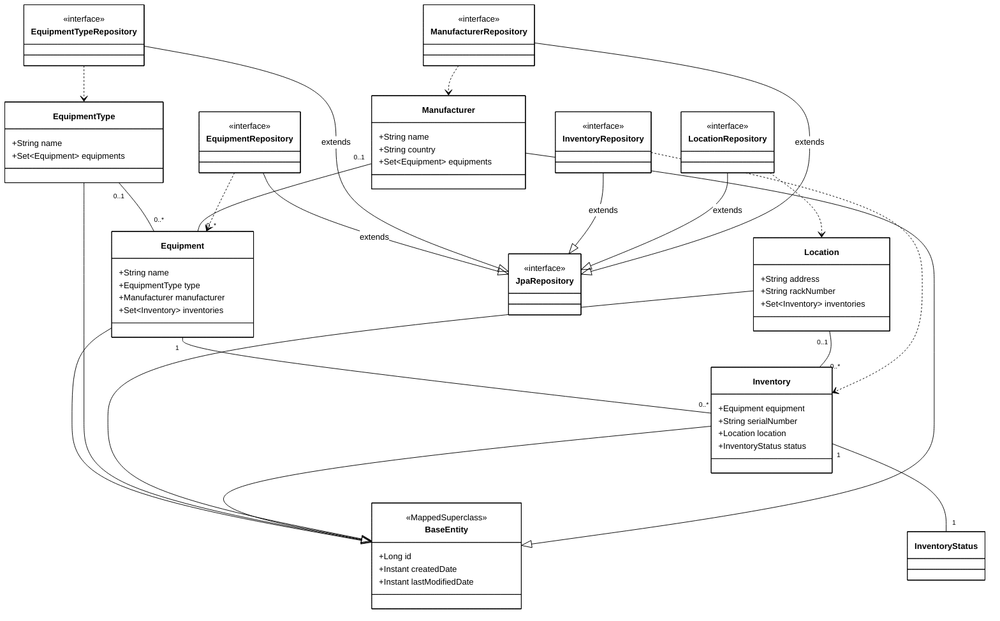
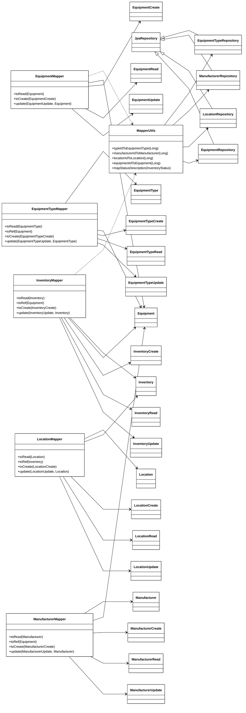
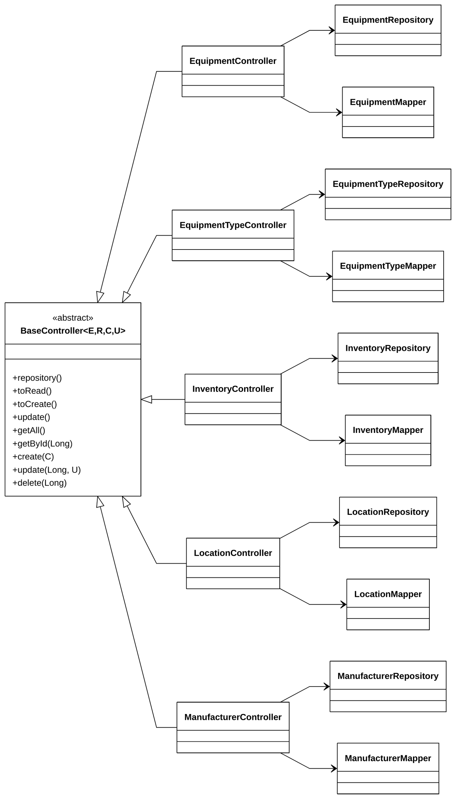
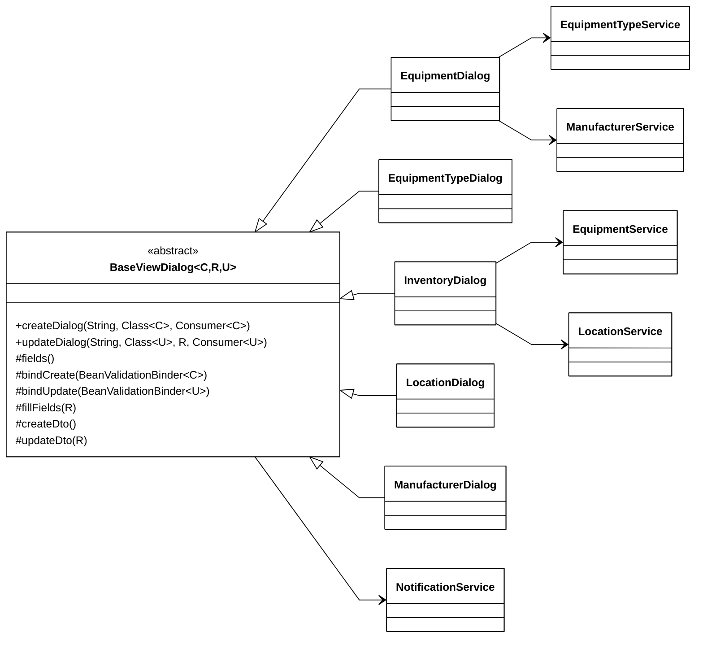
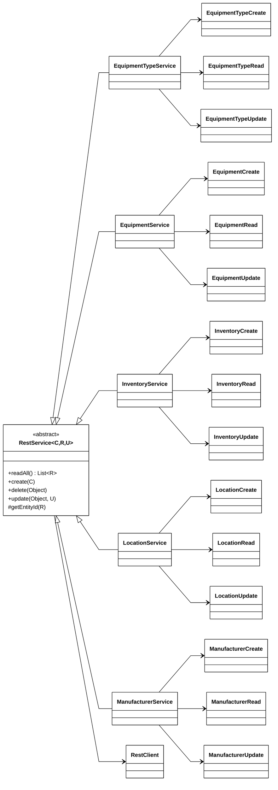
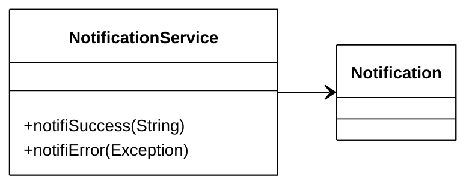
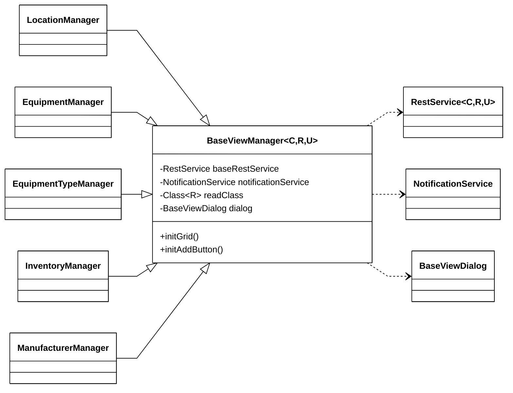
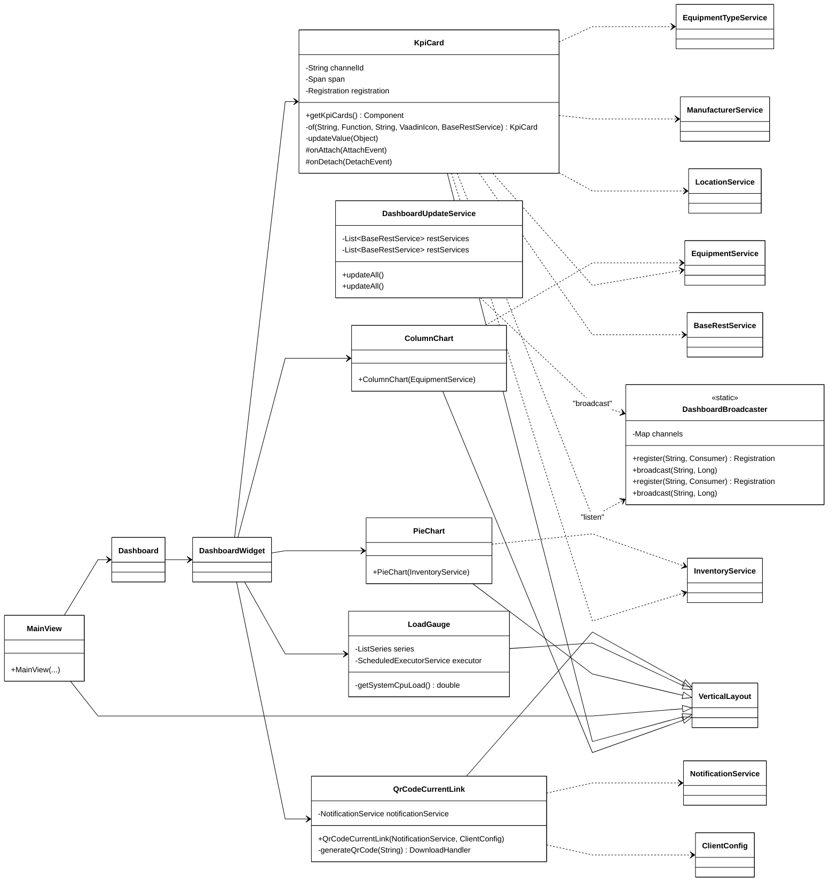

```mermaid
%%{init: {
  "theme": "base",
  "themeVariables": {
    "primaryColor": "#ffffff",
    "primaryTextColor": "#000000",
    "primaryBorderColor": "#000000",
    "lineColor": "#000000",
    "secondaryColor": "#ffffff",
    "tertiaryColor": "#ffffff",
    "fontSize": "14px"
  }
}}%%
classDiagram	
    class BaseEntity {
        <<MappedSuperclass>>
        +Long id
        +Instant createdDate
        +Instant lastModifiedDate
    }

    class Equipment {
        +String name
        +EquipmentType type
        +Manufacturer manufacturer
        +Set~Inventory~ inventories
    }

    class EquipmentType {
        +String name
        +Set~Equipment~ equipments
    }

    class Inventory {
        +Equipment equipment
        +String serialNumber
        +Location location
        +InventoryStatus status
    }

    class Location {
        +String address
        +String rackNumber
        +Set~Inventory~ inventories
    }

    class Manufacturer {
        +String name
        +String country
        +Set~Equipment~ equipments
    }

    %% Наследование
    Equipment --|> BaseEntity
    EquipmentType --|> BaseEntity
    Inventory --|> BaseEntity
    Location --|> BaseEntity
    Manufacturer --|> BaseEntity

    %% Отношения и мощность
    EquipmentType "0..1" -- "0..*" Equipment
    Manufacturer "0..1" -- "0..*" Equipment
    Equipment "1" -- "0..*" Inventory
    Location "0..1" -- "0..*" Inventory
    Inventory "1" -- "1" InventoryStatus
    
	%% Базовые интерфейсы Spring Data JPA
    class JpaRepository {
        <<interface>>
    }
    
	%% Репозитории (Interfaces)
    class EquipmentRepository {
        <<interface>>
    }
    class EquipmentTypeRepository {
        <<interface>>
    }
    class InventoryRepository {
        <<interface>>
    }
    class LocationRepository {
        <<interface>>
    }
    class ManufacturerRepository {
        <<interface>>
    }

    %% Наследование репозиториев от JpaRepository
    EquipmentRepository --|> JpaRepository : extends
    EquipmentTypeRepository --|> JpaRepository : extends
    InventoryRepository --|> JpaRepository : extends
    LocationRepository --|> JpaRepository : extends
    ManufacturerRepository --|> JpaRepository : extends

    %% Связь репозиториев с их сущностями (зависимость)
    EquipmentRepository ..> Equipment
    EquipmentTypeRepository ..> EquipmentType
    InventoryRepository ..> Inventory 
    LocationRepository ..> Location
    ManufacturerRepository ..> Manufacturer
```

```mermaid
%%{init: {
  "theme": "base",
  "themeVariables": {
    "primaryColor": "#ffffff",
    "primaryTextColor": "#000000",
    "primaryBorderColor": "#000000",
    "lineColor": "#000000",
    "secondaryColor": "#ffffff",
    "tertiaryColor": "#ffffff",
    "fontSize": "14px"
  },
  "flowchart": {
    "curve": "linear"
  }
}}%%
classDiagram
	direction LR
	
	class EquipmentTypeCreate {
        <<record>>
        + String name
    }
    
    class EquipmentTypeRead {
        <<record>>
        + Long id
        + String name
        + Set~EquipmentRefInTypeRead~ equipments
    }

    class EquipmentRefInTypeRead {
        <<record>>
        + Long id
        + String name
        + String manufacturerName
    }

    EquipmentTypeRead "1" *-- "*" EquipmentRefInTypeRead
    
    class EquipmentTypeUpdate {
		<<record>>
		+ Long id
		+ String name
	}
	
	class EquipmentRead {
		<<record>>
		+ Long id
		+ String name
		+ EquipmentTypeInRefEquipmentRead type
		+ ManufacturerRefInEquipmentRead manufacturer
		+ Set~InventoryRefInEquipmentRead~ inventories
	}

	class EquipmentTypeInRefEquipmentRead {
		<<record>>
		+Long id
		+String name
	}

	class ManufacturerRefInEquipmentRead {
		<<record>>
		+ Long id
		+ String name
		+ String country
	}

	class InventoryRefInEquipmentRead {
		<<record>>
		+ Long id
		+ String inventoryNumber
	}

	EquipmentRead "1" *-- "1" EquipmentTypeInRefEquipmentRead
	EquipmentRead "1" *-- "1" ManufacturerRefInEquipmentRead
	EquipmentRead "1" *-- "1" InventoryRefInEquipmentRead
	
	class EquipmentCreate {
		<<record>>
		+ String name
		+ EquipmentTypeInRefInEquipmentCreate type
		+ ManufacturerRefInEquipmentCreate manufacturer
	}

	class EquipmentTypeInRefInEquipmentCreate {
		<<record>>
		+ Long id
	}

	class ManufacturerRefInEquipmentCreate {
		<<record>>
		+ Long id
	}
		
	EquipmentCreate "1" *-- "1" EquipmentTypeInRefInEquipmentCreate
	EquipmentCreate "1" *-- "1" ManufacturerRefInEquipmentCreate

	class EquipmentUpdate {
		<<record>>
		+ Long id
		+ String name
		+ EquipmentTypeRefInEquipmentUpdate type
		+ ManufacturerRefInEquipmentUpdate manufacturer
	}

	class EquipmentTypeRefInEquipmentUpdate {
		<<record>>
		+ Long id
	}

	class ManufacturerRefInEquipmentUpdate {
		<<record>>
		+ Long id
	}
	
	EquipmentUpdate "1" *-- "1" EquipmentTypeRefInEquipmentUpdate
	EquipmentUpdate "1" *-- "1" ManufacturerRefInEquipmentUpdate
	
	class InventoryRead {
		<<record>>
		+ Long id
		+ String serialNumber
		+ InventoryStatus status
		+ String statusDescription
		+ EquipmentRefInInventoryRead equipment
		+ LocationRefInInventoryRead location
		+ Instant createdDate
		+ Instant lastModifiedDate
	}

	class EquipmentRefInInventoryRead {
		<<record>>
		+ Long id
		+ String name
		+ String typeName
		+ String manufacturerName
	}

	class LocationRefInInventoryRead {
		<<record>>
		+ Long id
		+ String address
		+ String rackNumber
	}

	InventoryRead "1" *-- "1" EquipmentRefInInventoryRead
	InventoryRead "1" *-- "0..1" LocationRefInInventoryRead
	InventoryRead "1" *-- "1" InventoryStatus
	
	class InventoryCreate {
		<<record>>
		+ String serialNumber
		+ EquipmentRefInInventoryCreate equipment
		+ LocationRefInInventoryCreate location
		+ InventoryStatus status
	}

	class EquipmentRefInInventoryCreate {
		<<record>>
		+ Long id
	}

	class LocationRefInInventoryCreate {
		<<record>>
		+ Long id
	}

	InventoryCreate "1" *-- "1" EquipmentRefInInventoryCreate
	InventoryCreate "1" *-- "0..1" LocationRefInInventoryCreate
	InventoryCreate "1" *-- "1" InventoryStatus
	
	class InventoryUpdate {
		<<record>>
		+ Long id
		+ String serialNumber
		+ EquipmentRefInInventoryUpdate equipment
		+ LocationRefInInventoryUpdate location
		+ InventoryStatus status
	}

	class EquipmentRefInInventoryUpdate {
		<<record>>
		+ Long id
	}

	class LocationRefInInventoryUpdate {
		<<record>>
		+ Long id
	}

	InventoryUpdate "1" *-- "1" EquipmentRefInInventoryUpdate
	InventoryUpdate "1" *-- "0..1" LocationRefInInventoryUpdate
	InventoryUpdate "1" *-- "1" InventoryStatus

    class InventoryStatus {
        <<enum>>
        ACTIVE("В эксплуатации")
		REPAIR("На ремонте")
		STOCK("На складе")
		DECOMMISSIONED("Списан")
		TRANSIT("В пути (логистика)")
		TESTING("На тестировании")
		RESERVED("Зарезервировано")
		BROKEN("Неисправен (ожидает решения)")
		LOST("Утерян/Кража")
		WARRANTY_REPLACEMENT("Гарантийная замена")
    }
    
	class LocationCreate {
		+ String address
		+ String rackNumber
	}

	class LocationRead {
		+ Long id
		+ String address
		+ String rackNumber
		+ Set~InventoryRefInLocationRead~ inventories
	}

	class InventoryRefInLocationRead {
		+ Long id
		+ String serialNumber
		+ String equipmentName
		+ String status
	}

	class LocationUpdate {
		+ Long id
		+ String address
		+ String rackNumber
	}
	
	LocationRead "1" *-- "*" InventoryRefInLocationRead
	
	class ManufacturerCreate {
        + String name
        + String country
    }

    class ManufacturerRead {
        + Long id
        + String name
        + String country
        + Set~EquipmentRefInManufacturerRead~ equipments
    }

    class EquipmentRefInManufacturerRead {
        + Long id
        + String name
        + String typeName
    }

    class ManufacturerUpdate {
        + Long id
        + String name
        + String country
    }

    ManufacturerRead "1" *-- "*" EquipmentRefInManufacturerRead
```

```mermaid
%%{init: {
  "theme": "base",
  "themeVariables": {
    "primaryColor": "#ffffff",
    "primaryTextColor": "#000000",
    "primaryBorderColor": "#000000",
    "lineColor": "#000000",
    "secondaryColor": "#ffffff",
    "tertiaryColor": "#ffffff",
    "fontSize": "14px"
  },
  "flowchart": {
    "curve": "linear"
  }
}}%%
classDiagram
	direction LR
	
	class MapperUtils {
		+typeIdToEquipmentType(Long)
		+manufacturerIdToManufacturer(Long)
		+locationIdToLocation(Long)
		+equipmentIdToEquipment(Long)
		+mapStatusDescription(InventoryStatus)
	}

	MapperUtils --> EquipmentTypeRepository
	MapperUtils --> ManufacturerRepository
	MapperUtils --> LocationRepository
	MapperUtils --> EquipmentRepository
	JpaRepository <|-- EquipmentTypeRepository
	JpaRepository <|-- ManufacturerRepository
	JpaRepository <|-- LocationRepository
	JpaRepository <|-- EquipmentRepository

	class EquipmentMapper {
		+toRead(Equipment)
		+toCreate(EquipmentCreate)
		+update(EquipmentUpdate, Equipment)
	}

	EquipmentMapper ..> MapperUtils
	EquipmentMapper --> Equipment
	EquipmentMapper --> EquipmentCreate
	EquipmentMapper --> EquipmentRead
	EquipmentMapper --> EquipmentUpdate

	class EquipmentTypeMapper {
		+toRead(EquipmentType)
		+toRef(Equipment)
		+toCreate(EquipmentTypeCreate)
		+update(EquipmentTypeUpdate, EquipmentType)
	}

	EquipmentTypeMapper --> EquipmentType
	EquipmentTypeMapper --> Equipment
	EquipmentTypeMapper --> EquipmentTypeCreate
	EquipmentTypeMapper --> EquipmentTypeRead
	EquipmentTypeMapper --> EquipmentTypeUpdate

	class InventoryMapper {
		+toRead(Inventory)
		+toRef(Equipment)
		+toCreate(InventoryCreate)
		+update(InventoryUpdate, Inventory)
	}

	InventoryMapper ..> MapperUtils
	InventoryMapper --> Inventory
	InventoryMapper --> Equipment
	InventoryMapper --> InventoryCreate
	InventoryMapper --> InventoryRead
	InventoryMapper --> InventoryUpdate

	class LocationMapper {
		+toRead(Location)
		+toRef(Inventory)
		+toCreate(LocationCreate)
		+update(LocationUpdate, Location)
	}

	LocationMapper --> Location
	LocationMapper --> Inventory
	LocationMapper --> LocationCreate
	LocationMapper --> LocationRead
	LocationMapper --> LocationUpdate

	class ManufacturerMapper {
		+toRead(Manufacturer)
		+toRef(Equipment)
		+toCreate(ManufacturerCreate)
		+update(ManufacturerUpdate, Manufacturer)
	}

	ManufacturerMapper --> Manufacturer
	ManufacturerMapper --> Equipment
	ManufacturerMapper --> ManufacturerCreate
	ManufacturerMapper --> ManufacturerRead
	ManufacturerMapper --> ManufacturerUpdate
```

```mermaid
%%{init: {
  "theme": "base",
  "themeVariables": {
    "primaryColor": "#ffffff",
    "primaryTextColor": "#000000",
    "primaryBorderColor": "#000000",
    "lineColor": "#000000",
    "secondaryColor": "#ffffff",
    "tertiaryColor": "#ffffff",
    "fontSize": "14px"
  },
  "flowchart": {
    "curve": "linear"
  }
}}%%
classDiagram
    direction LR

    class BaseController~E,R,C,U~ {
        <<abstract>>
        +repository()
        +toRead()
        +toCreate()
        +update()
        +getAll()
        +getById(Long)
        +create(C)
        +update(Long, U)
        +delete(Long)
    }

    class EquipmentController
    class EquipmentTypeController
    class InventoryController
    class LocationController
    class ManufacturerController

    BaseController <|-- EquipmentController
    BaseController <|-- EquipmentTypeController
    BaseController <|-- InventoryController
    BaseController <|-- LocationController
    BaseController <|-- ManufacturerController

    EquipmentController --> EquipmentRepository
    EquipmentController --> EquipmentMapper

    EquipmentTypeController --> EquipmentTypeRepository
    EquipmentTypeController --> EquipmentTypeMapper

    InventoryController --> InventoryRepository
    InventoryController --> InventoryMapper

    LocationController --> LocationRepository
    LocationController --> LocationMapper

    ManufacturerController --> ManufacturerRepository
    ManufacturerController --> ManufacturerMapper
```

```mermaid
%%{init: {
  "theme": "base",
  "themeVariables": {
    "primaryColor": "#ffffff",
    "primaryTextColor": "#000000",
    "primaryBorderColor": "#000000",
    "lineColor": "#000000",
    "secondaryColor": "#ffffff",
    "tertiaryColor": "#ffffff",
    "fontSize": "14px"
  },
  "flowchart": {
    "curve": "linear"
  }
}}%%
classDiagram
    direction LR

    class BaseViewDialog~C,R,U~ {
        <<abstract>>
        +createDialog(String, Class~C~, Consumer~C~)
        +updateDialog(String, Class~U~, R, Consumer~U~)
        #fields()
        #bindCreate(BeanValidationBinder~C~)
        #bindUpdate(BeanValidationBinder~U~)
        #fillFields(R)
        #createDto()
        #updateDto(R)
    }

    class EquipmentDialog
    class EquipmentTypeDialog
    class InventoryDialog
    class LocationDialog
    class ManufacturerDialog

    BaseViewDialog <|-- EquipmentDialog
    BaseViewDialog <|-- EquipmentTypeDialog
    BaseViewDialog <|-- InventoryDialog
    BaseViewDialog <|-- LocationDialog
    BaseViewDialog <|-- ManufacturerDialog

    class NotificationService

    BaseViewDialog --> NotificationService

    class EquipmentTypeService
    class ManufacturerService
    class EquipmentService
    class LocationService

    EquipmentDialog --> EquipmentTypeService
    EquipmentDialog --> ManufacturerService

    InventoryDialog --> EquipmentService
    InventoryDialog --> LocationService
```

```mermaid
%%{init: {
  "theme": "base",
  "themeVariables": {
    "primaryColor": "#ffffff",
    "primaryTextColor": "#000000",
    "primaryBorderColor": "#000000",
    "lineColor": "#000000",
    "secondaryColor": "#ffffff",
    "tertiaryColor": "#ffffff",
    "fontSize": "14px"
  },
  "flowchart": {
    "curve": "linear"
  }
}}%%
classDiagram
    direction LR

    class RestService~C,R,U~ {
        <<abstract>>
        +readAll() List~R~
        +create(C)
        +delete(Object)
        +update(Object, U)
        #getEntityId(R)
    }

    class EquipmentTypeService
    class EquipmentService
    class InventoryService
    class LocationService
    class ManufacturerService

    RestService <|-- EquipmentTypeService
    RestService <|-- EquipmentService
    RestService <|-- InventoryService
    RestService <|-- LocationService
    RestService <|-- ManufacturerService

    class RestClient

    RestService --> RestClient

    class EquipmentTypeCreate
    class EquipmentTypeRead
    class EquipmentTypeUpdate

    class EquipmentCreate
    class EquipmentRead
    class EquipmentUpdate

    class InventoryCreate
    class InventoryRead
    class InventoryUpdate

    class LocationCreate
    class LocationRead
    class LocationUpdate

    class ManufacturerCreate
    class ManufacturerRead
    class ManufacturerUpdate

    EquipmentTypeService --> EquipmentTypeCreate
    EquipmentTypeService --> EquipmentTypeRead
    EquipmentTypeService --> EquipmentTypeUpdate

    EquipmentService --> EquipmentCreate
    EquipmentService --> EquipmentRead
    EquipmentService --> EquipmentUpdate

    InventoryService --> InventoryCreate
    InventoryService --> InventoryRead
    InventoryService --> InventoryUpdate

    LocationService --> LocationCreate
    LocationService --> LocationRead
    LocationService --> LocationUpdate
    
    ManufacturerService --> ManufacturerCreate
    ManufacturerService --> ManufacturerRead
    ManufacturerService --> ManufacturerUpdate
```

```mermaid
%%{init: {
  "theme": "base",
  "themeVariables": {
    "primaryColor": "#ffffff",
    "primaryTextColor": "#000000",
    "primaryBorderColor": "#000000",
    "lineColor": "#000000",
    "secondaryColor": "#ffffff",
    "tertiaryColor": "#ffffff",
    "fontSize": "14px"
  },
  "flowchart": {
    "curve": "linear"
  }
}}%%
classDiagram
    direction LR

    class NotificationService {
        +notifiSuccess(String)
        +notifiError(Exception)
    }

    class Notification

    NotificationService --> Notification
```

```mermaid
%%{init: {
  "theme": "base",
  "themeVariables": {
    "primaryColor": "#ffffff",
    "primaryTextColor": "#000000",
    "primaryBorderColor": "#000000",
    "lineColor": "#000000",
    "secondaryColor": "#ffffff",
    "tertiaryColor": "#ffffff",
    "fontSize": "14px"
  },
  "flowchart": {
    "curve": "linear"
  }
}}%%
classDiagram
    direction LR

    class BaseViewManager~C,R,U~ {
        -RestService baseRestService
        -NotificationService notificationService
        -Class~R~ readClass
        -BaseViewDialog dialog
        +initGrid()
        +initAddButton()
    }

    class RestService~C,R,U~
    class NotificationService
    class BaseViewDialog

    BaseViewManager ..> RestService
    BaseViewManager ..> NotificationService
    BaseViewManager ..> BaseViewDialog

    class LocationManager
    class EquipmentManager
    class EquipmentTypeManager
    class InventoryManager
    class ManufacturerManager

    LocationManager --|> BaseViewManager
    EquipmentManager --|> BaseViewManager
    EquipmentTypeManager --|> BaseViewManager
    InventoryManager --|> BaseViewManager
    ManufacturerManager --|> BaseViewManager
```

```mermaid
%%{init: {
  "theme": "base",
  "themeVariables": {
    "primaryColor": "#ffffff",
    "primaryTextColor": "#000000",
    "primaryBorderColor": "#000000",
    "lineColor": "#000000",
    "secondaryColor": "#ffffff",
    "tertiaryColor": "#ffffff",
    "fontSize": "14px"
  },
  "flowchart": {
    "curve": "linear"
  }
}}%%
classDiagram
    direction LR
    
    class ColumnChart {
        +ColumnChart(EquipmentService)
    }

    class KpiCard {
        -String channelId
        -Span span
        -Registration registration
        +getKpiCards() Component
        -of(String, Function, String, VaadinIcon, BaseRestService) KpiCard
        -updateValue(Object)
        #onAttach(AttachEvent)
        #onDetach(DetachEvent)
    }

    class DashboardBroadcaster {
        -Map channels
        +register(String, Consumer) Registration
        +broadcast(String, Long)
    }
    
	class DashboardUpdateService {
        -List~BaseRestService~ restServices
        +updateAll()
    }
    
    %% Наследование от Vaadin (указано неявно в коде)
    class VerticalLayout
    ColumnChart --|> VerticalLayout
    KpiCard --|> VerticalLayout

    %% Зависимости от сервисов
    KpiCard ..> EquipmentService
    KpiCard ..> EquipmentTypeService
    KpiCard ..> ManufacturerService
    KpiCard ..> LocationService
    KpiCard ..> InventoryService
    ColumnChart ..> EquipmentService
    
    class MainView {
        +MainView(...)
    }

    class PieChart {
        +PieChart(InventoryService)
    }

    class LoadGauge {
        -ListSeries series
        -ScheduledExecutorService executor
        -getSystemCpuLoad() double
    }

    class QrCodeCurrentLink {
        -NotificationService notificationService
        +QrCodeCurrentLink(NotificationService, ClientConfig)
        -generateQrCode(String) DownloadHandler
    }

    class DashboardBroadcaster {
        <<static>>
        +register(String, Consumer) Registration
        +broadcast(String, Long)
    }

    class DashboardUpdateService {
        -List~BaseRestService~ restServices
        +updateAll()
    }

    %% Иерархия MainView
    MainView --> Dashboard
    Dashboard --> DashboardWidget
    DashboardWidget --> KpiCard
    DashboardWidget --> ColumnChart
    DashboardWidget --> PieChart
    DashboardWidget --> LoadGauge
    DashboardWidget --> QrCodeCurrentLink

    %% Связи через Broadcaster
    KpiCard ..> DashboardBroadcaster : "listen"
    KpiCard ..> BaseRestService
    DashboardUpdateService ..> DashboardBroadcaster : "broadcast"

    %% Наследование Vaadin
    MainView --|> VerticalLayout
    PieChart --|> VerticalLayout
    PieChart ..> InventoryService
    LoadGauge --|> VerticalLayout
    QrCodeCurrentLink --|> VerticalLayout
    QrCodeCurrentLink ..> NotificationService
    QrCodeCurrentLink ..> ClientConfig
    
```
