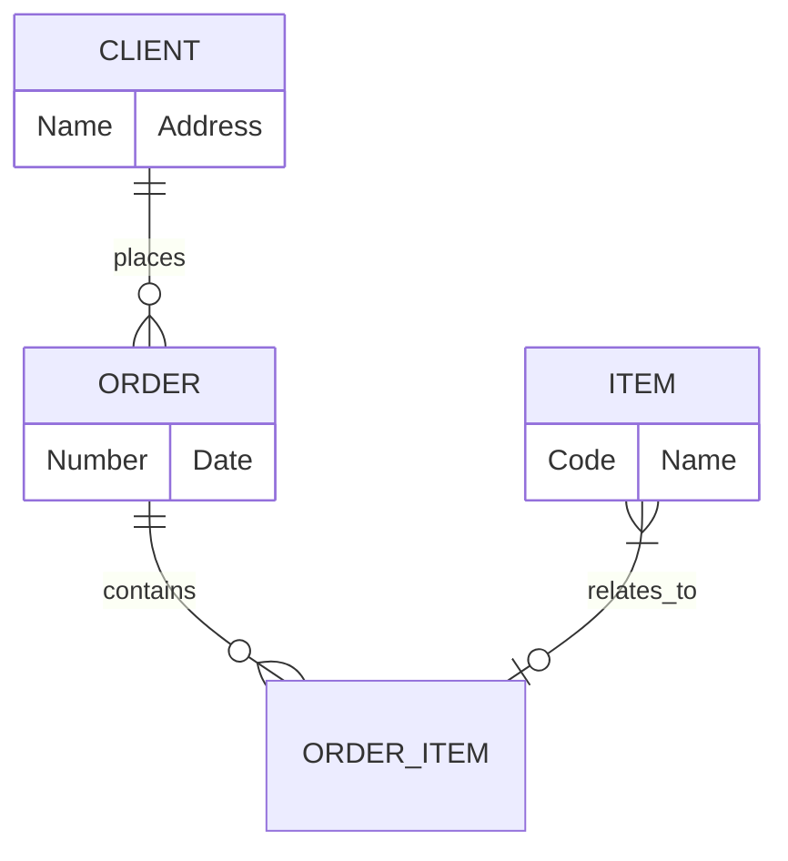

# ER-диаграмма

[[ЧГУ/Технология разработки программного обеспечения/Диаграмма классов|Концептуальные модели]] оперируют понятиями предметной области, атрибутами этих понятий и отношениями между ними. Понятию в предметной области разрабатываемого программного обеспечения могут соответствовать как материальные предметы, так и абстракции, которые применяют специалисты предметной области. 

В качестве *атрибутов* представляют некоторые существенные с точки зрения решаемой задачи характеристики объектов, например, идентифицирующие значения (имя, номер). Для конкретного объекта атрибут всегда имеет определенное значение.

> *Если некоторый объект X в реальном мире не является числом или текстом, то это скорее всего понятие. В противном случае - это атрибут.*
