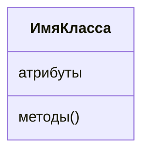
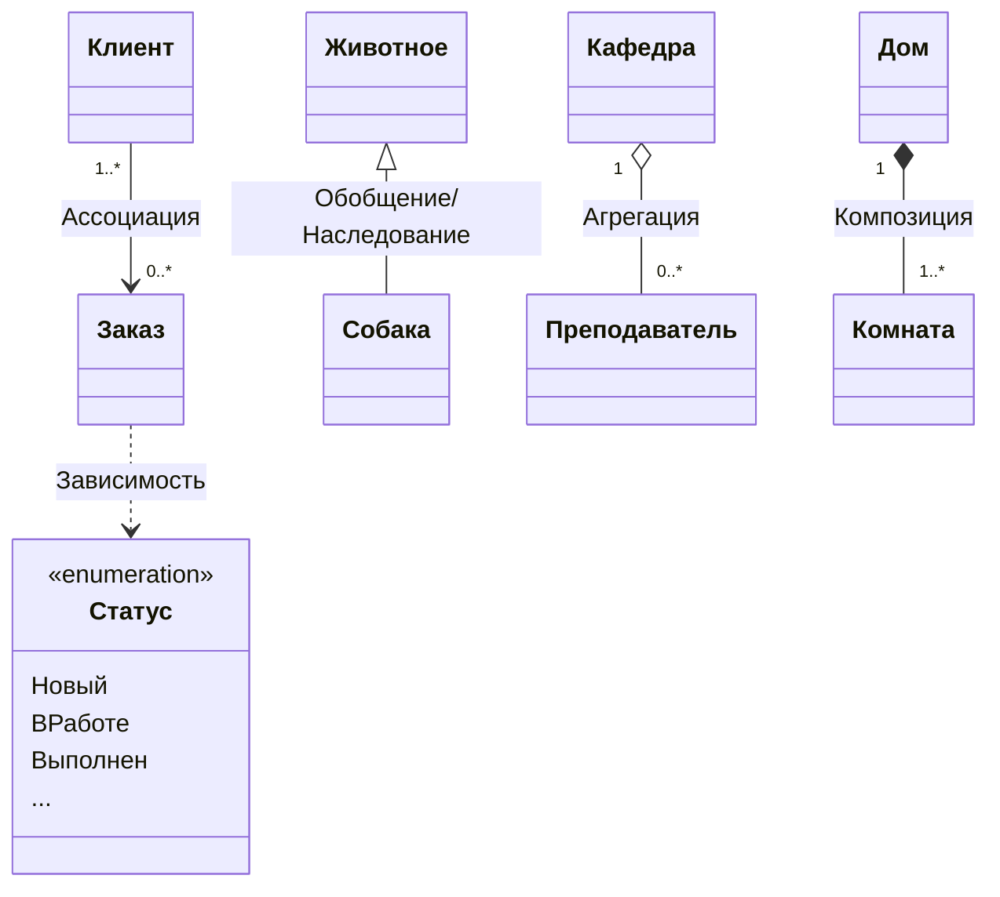
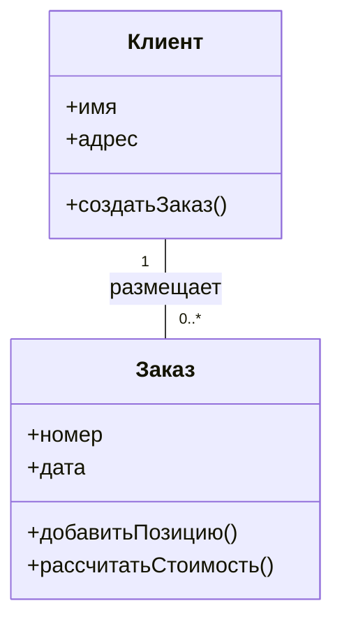

# Диаграмма классов

> ***Диаграмма классов (class diagram)*** - это структурная диаграмма [Понятие UML](Понятие%20UML.md), которая показывает структуру проектируемой системы на уровне [Класс](../Классы/Класс.md) и [Класс-интерфейс](../Классы/Класс-интерфейс.md), показывает их особенности, ограничения и отношения, но не содержит информацию о временных аспектах функционирования системы.

Чаще всего они используются для моделирования ***объектно-ориентированных систем*** и представляют статическое представление процессов этих систем.

В отличие от ранее существовавших нотаций, UML предлагает использовать три уровня диаграмм классов в зависимости от степени их детализации и этапа разработки программного обеспечения: 

1) ***концептуальный уровень***, на котором диаграммы классов, называемые в этом случае контекстными или [ER-диаграмма](../ER-диаграмма.md), демонстрируют связи между основными понятиями предметной области, которые используют на этапе анализа;
2) ***уровень спецификаций***, на котором диаграммы классов отображают интерфейсы классов предметной области, которые используют на этапе проектирования;
3) ***уровень реализации***, на котором диаграммы классов непосредственно показывают поля и операции конкретных классов, которые используют на этапе реализации.

Хорошо структурированная диаграмма классов:

1) сфокусирована на одном аспекте ([[Понятие варианта использования#^dc2b3f|варианте использования]]) статического представления дизайна системы;
2) содержит только те элементы, которые существенны для понимания данного аспекта;
3) обеспечивает детализацию, соответствующую уровню абстракции диаграммы, включая только важные для понимания дополнения;
4) не настолько упрощена, чтобы создать у читателя ложное представление о важной семантике.

Подобную, информацию на диаграмме классов можно представить в виде записи на естественном языке или в виде математической формулы, поместив их в фигурные скобки.

## Уровень спецификаций

Диаграммы классов уровня спецификации на этапе проектирования определяют структуру системы с точки зрения классов и их отношений, не углубляясь в детали реализации.

## Уровень реализации

Диаграммы классов уровня реализации детально описывает фактический программный код системы.

Средний отсек содержит список атрибутов, а нижний – список операций. Атрибуты и операции должны быть выровнены по ширине, а первая буква имени должна быть в нижнем регистре.

Существуют отношения [[../Классы/Отношения классов|ассоциации, зависимости, обобщения, агрегации и композиции]]. Cтрелка отношения направлена от пользователя ко владельцу используемой функциональности. Роль (название отношения) может обладать характеристикой множественности, которая показывает, сколько объектов может участвовать в одной связи с каждой стороны.

Допускается указывать множественность:

- * — от 0 до бесконечности;
- <целое>.. * — от заданного числа до бесконечности;
- <целое> — точно определенное количество объектов;
- <целое1>, <целое2>, ... , <целоеN> — несколько вариантов точного количества объектов;
- <целое1>..<целое2> — диапазон объектов.

UML определяет следующие специальные обозначения:

1. [[../Классы/Абстрактный класс|Абстрактный класс]] (для использования другими классификаторами, например, в качестве цели отношений *обобщения*) имеет имя, написанное курсивом, или помечен модификатором ([[../Классы/Стереотип|стереотипом]]) «abstract».
2. [[../Классы/Статический класс|Статический класс]] помечен модификатором «utility», а статические признаки имеют подчеркнутые имена.
3. Многоточие "..." в конце списка методов указывает на то, что дополнительные методы существуют, но не отображаются в этом списке.
4. Параметризованные классы или шаблоны (generic) используют условное обозначение уточнения \[T\].

![[../img/дкл1.jpg]]

В UML 2.5 класс стал структурированным, инкапсулированным и управляемым за счет расширения инкапсулированного классификатора и поведенческого классификатора. Из-за этого любой класс может иметь некоторую внутреннюю структуру и порты.

![[../img/дкл2.png]]

Атрибуты или операции могут быть сгруппированы по видимости. Ключевое слово или символ видимости в этом случае можно указать один раз для нескольких объектов с одинаковой видимостью (private, protected и public).

![[../img/дкл3.jpg]]

## Источники

[^1]: Буч Г., Рамбо Д., Якобсон И. Язык UML. Руководство пользователя. 2-е изд.: Пер. с англ. Мухин Н. – М.: ДМК Пресс. – 496 с.: ил.
[^2]: Иванова Г.С. Технология программирования : учебник/ Г.С. Иванова. - 3-е изд., стер. - М.: КНОРУС, 2016. - 334 с. - Бакалавриат).
[^3]: [Использование диаграммы классов UML при проектировании и документировании программного обеспечения / Хабр](https://habr.com/ru/articles/572234/)
